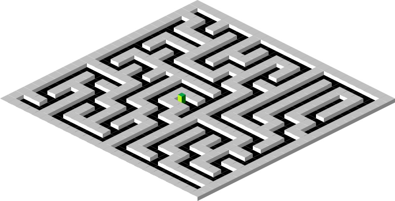

# maze
> Flexible perfect maze generator

This module generates "perfect mazes" (i.e. no loops) by connecting "nodes" from a given list.



Note that a "node" does not necessarily have to be a regular grid cell - it can be of any shape or size!

## install
```sh
npm install maze
```

## usage
See [`test.js`](https://github.com/semibran/maze/blob/master/test.js) for an extensive example. You could also clone this repository and run the script locally if you'd like to run the maze generator on your machine.

### `maze = generate(nodes, adjacent, choose)`
Maps each node in `nodes` to a list of connections and stores the resulting `Map` in `maze`.

- `nodes`: A list of nodes to connect
- `adjacent`: A function of the form `adjacent(a, b)` which determines if node `a` and node `b` can be connected
- `choose`: A function of the form `choose(array)` which chooses a random item from `array`

## license
[MIT](https://opensource.org/licenses/MIT) © [Brandon Semilla](https://git.io/semibran)
